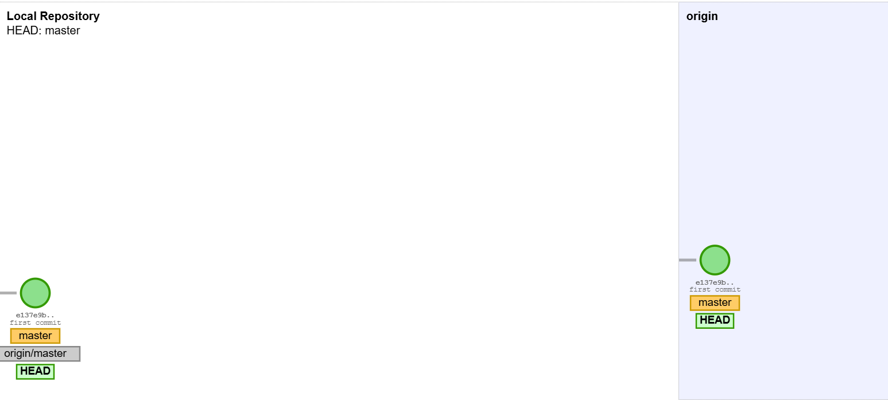
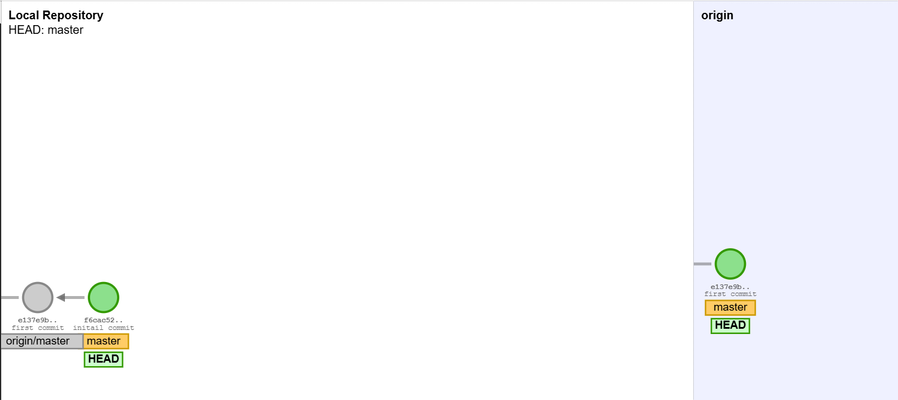
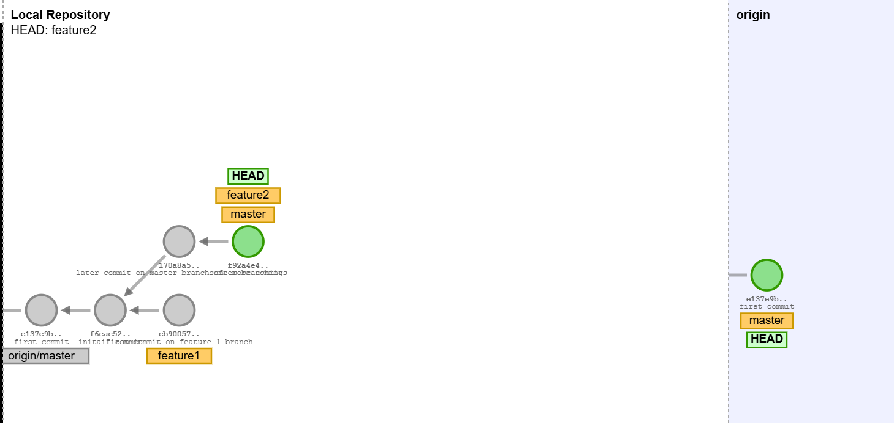
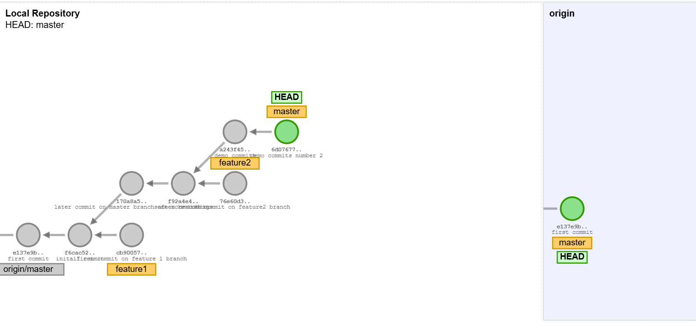
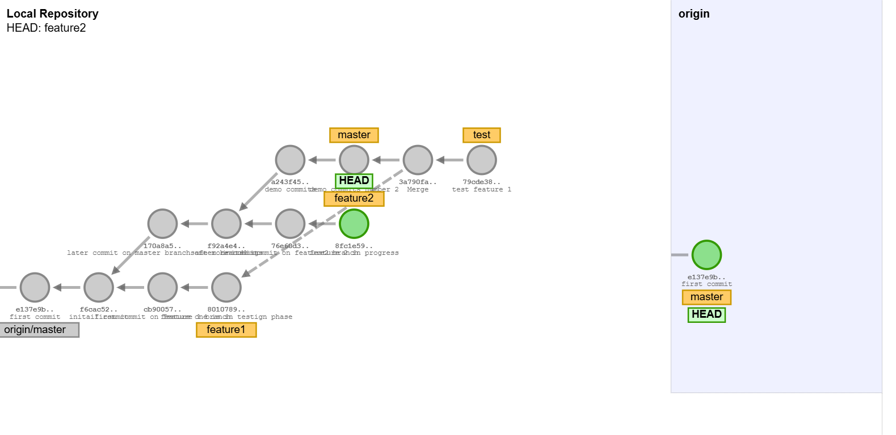
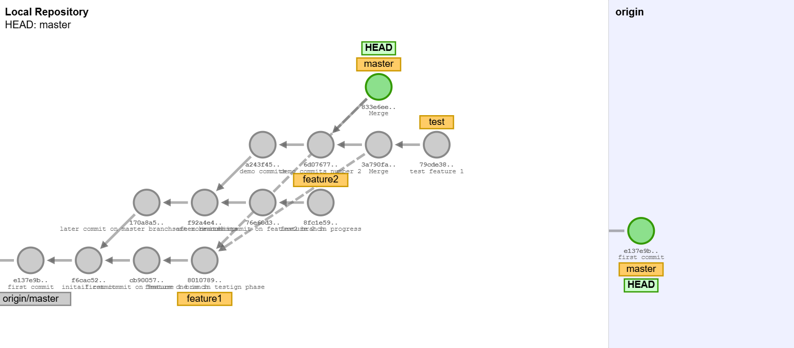
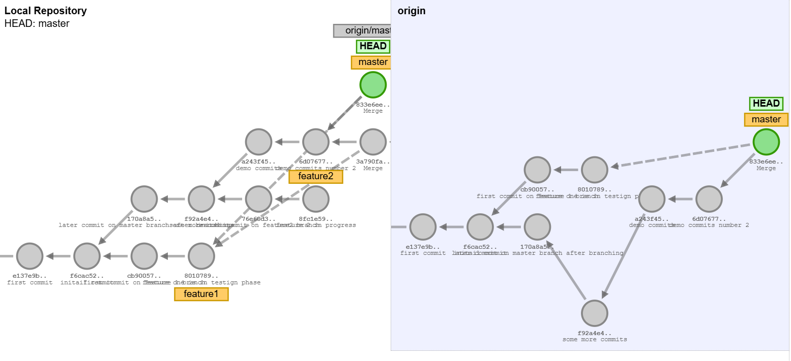
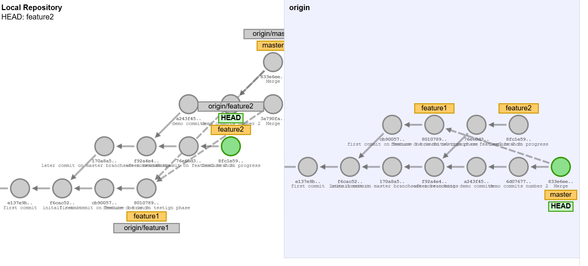

# Branching philosophy #

inital State of both Local and original(Remote) repo 


## git commit ##
git-commit - Record changes to the repository

Create a new commit containing the current contents of the index and the given log message describing the changes. The new commit is a direct child of HEAD, usually the tip of the current branch, and the branch is updated to point to it 

```bash
#syntax
git commit -m <Commit-message>

#example
git commit -m "initail commit"
```



> NOTE: All this changes will not be reflected on the Remote repo unless we push the changes.


## Branches ##

Branches are an in-built feature in the Git Versioning System. Consider it a way to make new changes to your code, or your organization's code without deleting everything by mistake. 

There are two ways to crate a branch 

* Method 1
```bash
#syntax
git branch <branch_name> 

#example
git branch feature1
```


* Method 2
```bash
#syntax
git checkout -b <branch_name> 

#example
git checkout -b feature2
```



> Later after some working and commits 



> Lets say by this time feature 1 is in testing phase 



> and the feature 1 is tested adn aproved now feature 1 needs to be integrated/merge with master branch



## Now we push local repo i,e. main and feature 1 and feature 2 to Remote repo 



> Add feature 1 and feature 2 into remote repo




### Pull Request steps

 


 


